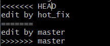

# Git学习笔记

## Git结构

工作区,暂存区,本地库/版本库
工作区（WORKING DIRECTORY）: 直接编辑文件的地方，肉眼可见直接操作；

暂存区（STAGIN AREA）：数据（快照）暂时存放的地方；

本地库/版本库（GIT DIRECTORT(RESPOSITORY)）：存放已经提交的数据，push 的时候，就是把这个区的数据 push 到远程git仓库了。

## 普通Git指令

    git help [指令] 查看指令响应文档
    git init 初始化git项目
    git status 查看项目状态
    git add [filename] 就是将工作区的修改缓存在暂存区
    git commit [filename] 就是将暂存区的数据快照提交到本地库
        -m "提交注释"
    git config 项目相关配置信息
        user.name xxx 当前项目用户的名称
        user.email xxx 当前项目用户的邮件
        --global 全局设置
    git log 查看项目历史记录
        多屏显示下的控制方式:空格向下翻页，b向上翻页，q推出
        --pretty=oneline 将每次修改按行简洁的显示
        --oneline 将每次修改按行更简洁的显示(哈希值显示前7位)
    git reflog
        HEAD@{移动到目标版本所需步数}
    git reset
        --soft 仅在本地库移动HEAD指针
        --mixed 在本地库移动HEAD指针 重置暂存区
        --hard  在本地库移动HEAD指针 重置暂存区 重置工作区
        [hash] 基于哈希索引的版本前进后退
        ex:
            git reset --hard d8f2065
            git reset --hard HEAD^ 后退^个数步
            git reset --hard HEAD~n 后退n步
    git diff [filename]
        ex:
            git diff [filename] 将工作区的文件与暂存区的文件进行比较
            git diff [hash/HEAD] [filenmae] 将工作区的文件与本地库的文件进行比较

## Git分支

    创建分支
        git branch [分支名]
    查看分支
        git branch -v
    切换分支
        git checkout [分支名]
    合并分支
        1.切换至要增加内容的主分支上 git checkout [分支名]
        2.执行merge命令 git merge [要合并的分支]
    解决合并冲突
        分支表现: 
         
        1.编辑文件，删除特殊符号
        2.修改文件后保存退出
        3.git add [filename]
        4.git commit -m "日志信息"(此时不能带具体文件名)
